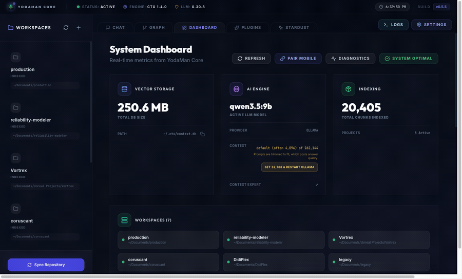
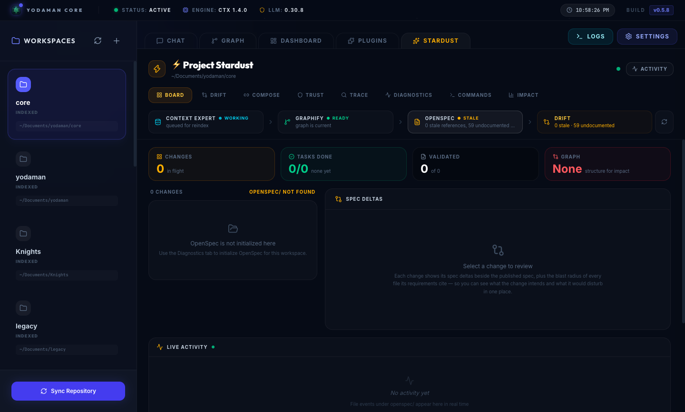
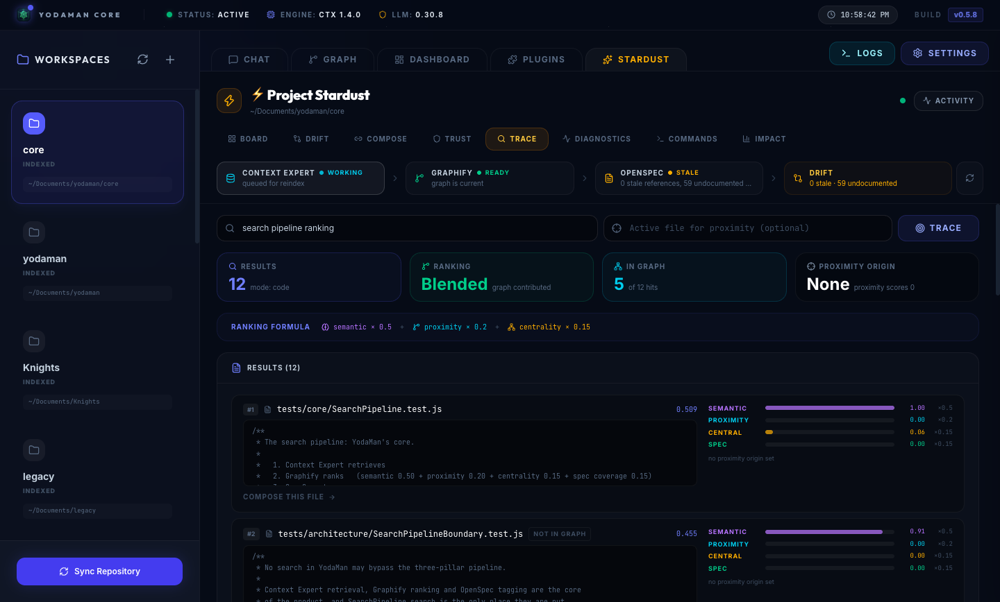
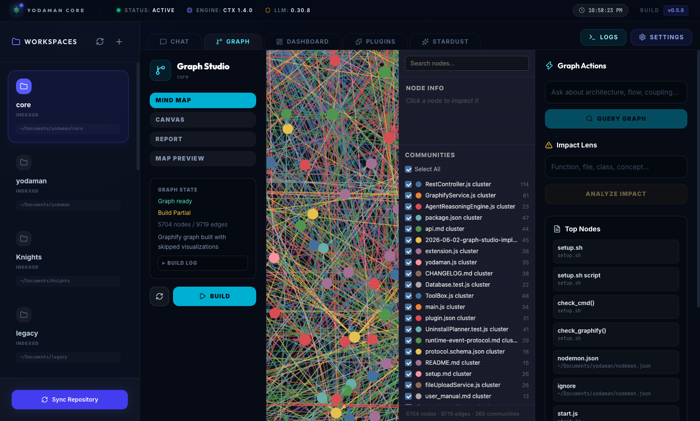
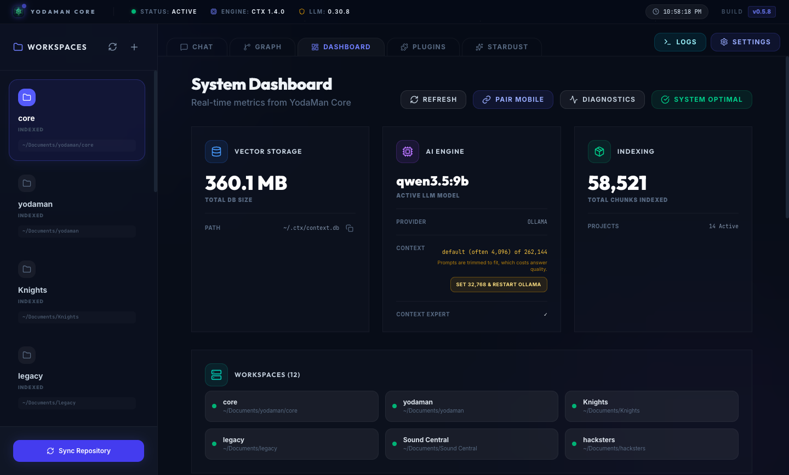

# YodaMan

**Local-first code intelligence that understands your workspace the way you do: what the code says, how it fits together, and what it was meant to do.**

   

YodaMan combines three tools into one search and one agent:

- **Context Expert** finds code by meaning.
- **Graphify** knows how the code is connected.
- **OpenSpec** records what the code is supposed to do.

Every search and every agent turn uses all three. Everything runs on your machine against a local model: no code is uploaded, no account, no API key.

## Contents

- [Two minutes in](#two-minutes-in)
- [What it looks like](#what-it-looks-like)
- [How search works](#how-search-works)
- [Install](#install)
- [Using YodaMan](#using-yodaman)
- [Choosing a model](#choosing-a-model)
- [Configuration](#configuration)
- [Connecting other agents (MCP)](#connecting-other-agents-mcp)
- [Project layout](#project-layout)
- [Contributing, security and license](#contributing)

## Two minutes in

You are about to change `validateSession()`. Before you touch it:

```bash
brew install Yoda-Man/yodaman/yodaman   # or: npm install -g yodaman
yodaman setup                           # installs the tools it needs
```

Ask YodaMan what depends on it:

> **32 files import it.** Four are in the auth middleware chain. Two are covered
> by no test. **And one, your `sessionRefresh` module, is load-bearing in the
> graph but described by no spec at all.**

That last sentence is the one you cannot get anywhere else. Your editor's search
finds the string and your language server finds the references, but neither
knows which parts of your system nobody has written down. That takes the
dependency graph and your specs read together, which is what YodaMan does on
every query.

## What it looks like



### Project Stardust

The workspace's state across all three tools in one place: Context Expert's
index, Graphify's graph and OpenSpec's specs, with drift between intent and
code called out.



**Trace** shows why each search result ranked where it did: its semantic score
from Context Expert, its proximity and centrality in the Graphify graph, and
its OpenSpec coverage, blended into the order you see.



### Graph Studio

The knowledge graph, clustered by community, with impact analysis and a
natural-language query box against the structure itself.



### Dashboard

Vector storage, the active local model and its context window, and every
indexed workspace. A context window too small for the prompt is the most common
cause of poor answers, so YodaMan says so and offers to fix it.



## How search works

Every search in YodaMan, whether typed into Search, asked in Chat, run by the
agent mid-task, shown in Trace, or requested by another agent over MCP, goes
through the same pipeline:

| Step | Tool | What it does |
|------|------|--------------|
| 1. Retrieve | **Context Expert** | Finds code and docs by meaning |
| 2. Clean | YodaMan | Removes duplicates, generated files, and files no longer on disk |
| 3. Rank | **Graphify** | Reorders by structure: semantic 0.50, proximity 0.20, centrality 0.15, spec coverage 0.15 |
| 4. Tag | **OpenSpec** | Marks each result with the specs that cover it |

Each response reports which tools actually contributed. If a workspace has no
graph yet, or no specs, results still come back and YodaMan tells you which
step was skipped and how to enable it; a partial search never looks like a full
one. The pipeline lives in one module, and an architecture test fails the build
if any code searches around it.

## Install

**Homebrew** (macOS and Linux):

```bash
brew install Yoda-Man/yodaman/yodaman
```

**npm** (anywhere Node 22+ runs):

```bash
npm install -g yodaman
```

Then let YodaMan install what it depends on:

```bash
yodaman setup
```

`setup` installs Context Expert, Graphify and OpenSpec. **Ollama is not
installed automatically**: it is a system service with its own installer, so
`setup` prints the command and leaves the decision to you. `yodaman setup
--dry-run` shows exactly what would run, without running it.

Desktop builds (`.dmg`, `.AppImage`) are on the
[releases page](https://github.com/Yoda-Man/yodaman/releases).

### Check your setup

```bash
yodaman doctor          # every dependency: version, path, reachability
yodaman doctor --graph  # knowledge graph freshness
```

`doctor` exits non-zero when anything is missing, so it can gate a script or CI
step; add `--json` for machine-readable output. The same checks appear in the
Dashboard health panel, at `GET /api/health`, and on the desktop startup screen,
where a missing component offers a one-click install.

### From source

```bash
git clone https://github.com/Yoda-Man/yodaman.git
cd yodaman/core
sh setup.sh
npm run desktop          # or: npm start, then open http://localhost:3090
```

Prerequisites: Node.js 22+, Python 3.10+, and Ollama. `yodaman setup` (or
`setup.sh`) installs the rest.

## Using YodaMan

**Search or ask.** The Search view returns ranked results with an **Open**
button. In Chat, a plain search such as "find where login is handled" is
answered directly from the search pipeline in seconds; anything that needs
reasoning ("explain", "fix", "compare") goes to the agent.

**Open results in your editor.** Clicking a result or a file link opens it at
the right line in your own editor. By default that is whatever your system
opens that file type with. To choose another, go to **Settings > Open files in**
and pick a detected editor, or enter a command for any editor:

| Editor | Command |
|--------|---------|
| JetBrains IDEs | `idea --line {line} {file}` |
| Xcode | `xed -l {line} {file}` |
| Emacs | `emacsclient -n +{line} {file}` |
| Anything else | `/path/to/editor {file}:{line}` |

`{file}`, `{line}` and `{column}` are filled in for you. The command is never
run through a shell, so a file name can never become part of a command.

**Let the agent work.** Agent tasks stream their progress, can be cancelled, and
stop for your approval with a diff and its blast radius before anything is
changed; see [Approvals](docs/guides/approvals.md). If a task runs out of steps,
it answers from what it found and lists the files it examined.

**Work with specs.** The agent can propose, validate and archive OpenSpec
changes (`specPropose`, `specValidate`, `specArchive`), and the Stardust tab
shows where specs and code have drifted apart.

**Use it where you are.** The web UI, desktop app, `yodaman` CLI, VS Code
extension and mobile companion all talk to the same local runtime.

**Extend it.** Plugins are plain JavaScript. YodaMan ships with CodeTrooper,
Droid-Sweep, Grand Inquisitor, Lightsaber and Graphify.

### The Stardust tabs

| Tab | Shows |
|-----|-------|
| **Board** | Live OpenSpec changes with task progress, spec diffs, and validate/archive |
| **Drift** | Where specs and the knowledge graph disagree |
| **Compose** | One file, seen by all three tools side by side |
| **Trust** | Per-tool health and whether answers can be trusted right now |
| **Trace** | Why each search result ranked where it did |
| **Impact** | Blast radius of a change, with spec awareness |
| **Diagnostics** | OpenSpec install, version and project setup |
| **Commands** | Propose, validate, archive and list, with console output |

## Choosing a model

**9B parameters is the floor, not the target.** YodaMan runs on a 9B model so it
works on modest hardware, and gets genuinely better, not merely faster, when you
give it more.

**If you run a bigger model, raise the context window to match.** Ollama serves
whatever `OLLAMA_CONTEXT_LENGTH` says; when it is unset it picks by available
VRAM, often **4096 tokens regardless of what the model supports**. A 32B model
served through a 4096-token window behaves like a 9B one.

| Model | Set `OLLAMA_CONTEXT_LENGTH` | YodaMan then sends | What you get |
|---|---|---|---|
| `qwen3.5:9b` *(minimum)* | `8192` | ~10,000 chars | Works. Tool-calling is occasionally unreliable. |
| `qwen2.5:14b` | `16384` | ~20,000 chars | Reliable tool-calling; the agent stops needing retries. |
| `codestral:22b` | `32768` | ~40,000 chars | Holds context across multi-step tasks. **Recommended.** |
| 32B-class, `deepseek-coder-v2` | `65536` to `131072` | ~80,000 to 120,000 chars | Whole files kept verbatim instead of clipped. |

When the window is too small, the Dashboard says so and offers to set it for you
(YodaMan writes the setting, restarts Ollama, and rolls back if the restart
fails). Or set it by hand:

```bash
export OLLAMA_CONTEXT_LENGTH=32768
```

The Health panel reports the window actually being served, not the one you
asked for; those differ more often than you would expect.

**Context costs VRAM** whether or not a request uses it. On a GPU that cannot
hold it, Ollama refuses to load the model or spills into system memory and slows
to a crawl; if that happens, step down one value. As a rough guide, 32768 is
comfortable on 24GB for a 14B to 22B model; below 16GB, stay at 8192 to 16384.

**Why YodaMan does not trust the model's advertised maximum.** A model may
declare 262,144 tokens while Ollama serves it 4096. Overflowing the served
window is silent: the server drops text from the front, so the first thing lost
is the system prompt carrying the tool instructions, and the model stops calling
tools without any visible error. YodaMan always sizes its prompt to the window
actually being served.

## Configuration

Copy `config.example.json` to `config.json` and add your workspace paths:

```json
{
  "watchedDirectories": ["/path/to/your/project"],
  "removedDirectories": []
}
```

If a workspace folder is moved or deleted, YodaMan marks it **Folder not found**
instead of serving results from its old index. Edit its path or remove
it in **Settings**.

### Settings

These live under `settings` in `config.json` and are editable in the app.
**Every security setting defaults to the safe value.**

| Setting | Default | Effect |
|---------|---------|--------|
| `requirePairingToken` | `true` | Non-local clients must present a pairing token. Turning this off exposes the API to any device that can reach the port. |
| `allowAgentCommands` | `false` | Lets the agent run shell commands, restricted to an executable allowlist. |
| `allowPluginUploads` | `false` | Accepts plugin uploads over `POST /api/plugins`. |
| `allowUnrestrictedPlugins` | `false` | Loads plugins that declare no `permissions` array. |
| `allowSelfHealInstall` | `false` | Lets `POST /api/health/install` install missing dependencies. |
| `allowedCommands` | `[]` | Extra executables the agent may run. Bare names only, for example `["docker", "kubectl"]`. |
| `editorCommand` | `""` | How files are opened. Empty means the system default; see [Using YodaMan](#using-yodaman). Can only be changed from this computer. |

Agent shell commands run without a shell, so `;`, `|`, `&`, backticks, `$(…)`
and redirection are rejected rather than interpreted, and inline evaluation
(`node -e`, `python3 -c`) is refused. Inspect the effective policy with
`GET /api/policy`.

### Environment variables

Any setting can be overridden by an environment variable named after it with a
`YODAMAN_` prefix, for example `YODAMAN_ALLOW_AGENT_COMMANDS` or
`YODAMAN_EDITOR_COMMAND`. Environment variables take precedence over
`config.json`.

| Variable | Default | Purpose |
|----------|---------|---------|
| `YODAMAN_PORT` | `3090` | HTTP and WebSocket port. |
| `YODAMAN_HOST` | `127.0.0.1` | Bind address. **Loopback by default.** Set `0.0.0.0` only to pair a phone on your LAN; the API then reaches every device on that network. |
| `YODAMAN_CONFIG_PATH` | `./config.json` | Config file location. |
| `YODAMAN_DB_PATH` | `./yodaman.db` | SQLite database location. |
| `YODAMAN_UPLOAD_ROOT` | OS temp dir | Where uploaded files are staged. |
| `YODAMAN_WATCH_DEBOUNCE_MS` | `1500` | File-watcher debounce before re-indexing. |
| `YODAMAN_LOG_DIR` | `~/.yodaman/logs` | Directory for `runtime.log`. |
| `YODAMAN_LOG_TO_FILE` | `true` | Set `false` to log to stdout only. |
| `YODAMAN_LOG_MAX_BYTES` | `5242880` | Rotate `runtime.log` at this size. |
| `YODAMAN_LOG_MAX_FILES` | `3` | Rotated files to keep. |
| `YODAMAN_AGENT_PROMPT_CHARS` | | Caps the character budget for agent prompts. |
| `YODAMAN_CTX_ASK_TIMEOUT_MS` | | Timeout for `ctx ask` calls. |
| `YODAMAN_GRAPHIFY_BIN` | `graphify` | Path to the Graphify binary. |
| `YODAMAN_GRAPHIFY_TIMEOUT_MS` | `300000` | Graphify subprocess timeout. Raise it for very large workspaces. |
| `YODAMAN_GRAPHIFY_OLLAMA_MODEL` | | Model Graphify uses for enrichment. |
| `YODAMAN_GRAPHIFY_FULL_EXTRACT` | | Forces a full re-extract instead of an incremental one. |
| `YODAMAN_GRAPHIFY_VIZ_NODE_LIMIT` | `25000` | Largest graph rendered as an HTML visualisation. |
| `YODAMAN_GRAPHIFY_RUNNING_STALE_MS` | | When a running Graphify job is treated as abandoned. |

Frontend build-time variables (Vite): `VITE_YODAMAN_API_BASE`,
`VITE_YODAMAN_FETCH_TIMEOUT_MS`.

## Connecting other agents (MCP)

Cursor, Claude Code, Zed and any other MCP client can query YodaMan's index
through its MCP server. Setup for each client is in [MCP](docs/guides/mcp.md)
and in the app under **Settings > Connect other agents**.

**It stays local.** The server runs over stdio: nothing listens on a port, and
there are no API keys and no account. The protocol is standard; where the data
goes is our decision, and it goes nowhere.

**YodaMan is a server, not a client, deliberately.** Consuming third-party MCP
servers for search or memory would have replaced Context Expert, Graphify and
OpenSpec with generic equivalents, trading the thing that makes YodaMan
different for a weaker version of itself.

**It makes strong models better on your code.** Hosted assistants run models
far stronger than most people can run locally, and know nothing about your
private codebase. YodaMan knows which modules are load-bearing, what a change
would reach, and which files no spec describes. Serving that to them joins their
reasoning to your local knowledge, without the code leaving the machine.

**Every tool is read-only, permanently.** YodaMan's approval gate lives in its
own agent loop, which an MCP client never enters. The test suite fails if a
mutating tool appears on the server, if it issues a `PUT`, `PATCH` or `DELETE`,
or if it imports a write path. To change files through YodaMan, use YodaMan's
agent, where consent is enforced.

## Project layout

| Project | Description |
|---------|-------------|
| **YodaMan Core** (`core/`) | Runtime, React UI, agent, search pipeline, plugins |
| **Lightsaber** (`lightsaber/`) | Git health map plugin: code hotspot analysis |
| **Holocron VR** (`Holocron VR/`) | 3D VR codebase explorer (community plugin) |

```
core/
├── backend/
│   ├── core/              # Agent engine, search pipeline, indexing queue
│   ├── infrastructure/    # ToolBox, Context Expert, Graphify, editor launcher, logging
│   ├── interfaces/        # REST API and route groups
│   ├── services/          # Git, search endpoints, file upload
│   └── stardust/          # Spec drift, OpenSpec CLI, live updates
├── bin/                   # `yodaman` CLI and MCP server
├── electron/              # Desktop app
├── extensions/            # VS Code extension
├── plugins/               # Bundled plugins
├── shared/                # Code shared by the runtime, UI and clients
├── src/                   # React UI
├── tests/                 # Jest suites, including architecture tests
└── website/               # Public website and downloads
```

Much of the codebase is reached without a static import: plugins are loaded
from a computed path, plugin UI components are named as strings in
`plugins/plugin.json`, and several files are entry points launched by a host.
Import-graph tools report those as dead; `tests/architecture/NoDeadModules.test.js`
is the check that accounts for them.

**Built with** Node.js and Express 5, React 19, Vite and Tailwind CSS, Electron,
SQLite, Ollama, Context Expert, Graphify and OpenSpec.

## Contributing

Issues are very welcome: bug reports, feature requests and questions.

Please open an issue before a pull request. YodaMan has a few architectural
commitments (every search goes through the three-tool pipeline, the MCP server
is read-only, nothing leaves the machine, the approval gate defaults to deny)
that are easier to agree on before code is written than after.
[CONTRIBUTING.md](CONTRIBUTING.md) sets them out, along with the testing
standard. By participating you agree to the [Code of Conduct](CODE_OF_CONDUCT.md).

## Security

Please report vulnerabilities privately rather than in a public issue. See
[SECURITY.md](SECURITY.md) for the process and what is in scope.

## Upgrading and uninstalling

[UPGRADING.md](UPGRADING.md) covers upgrades between 0.5.x versions (no
migration is needed) and how to remove YodaMan and everything it generates.

## License

[MIT](LICENSE). Copyright (c) 2026 Marwa Trust Mutemasango.
