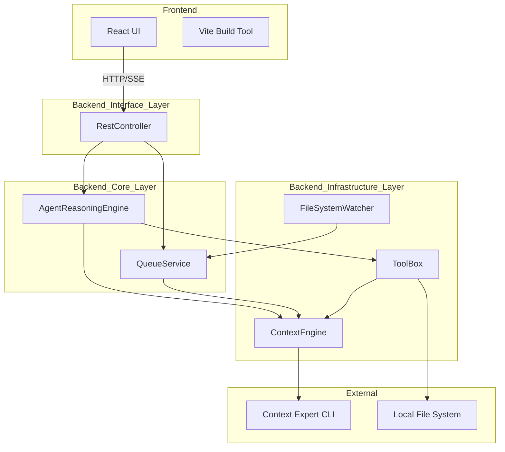
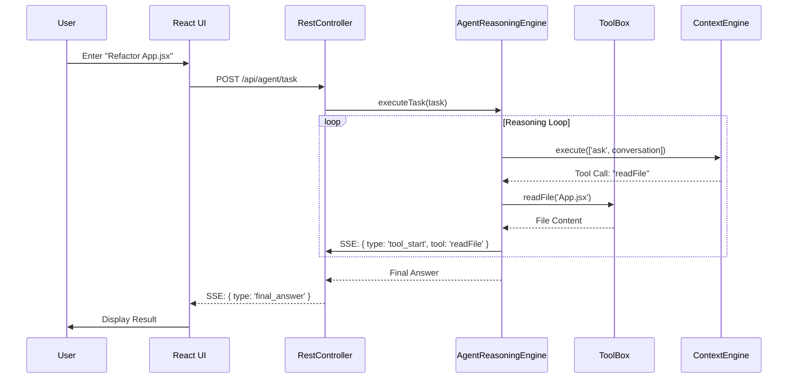

# YodaMan Architecture Overview

This document describes the high-level architecture of YodaMan, a premium intelligence platform for developers.

## System Architecture

YodaMan follows a **Clean Architecture** pattern to ensure separation of concerns, testability, and maintainability.

## Layer Responsibilities

### 1. Interface Layer (`backend/interfaces`)
- **RestController**: Handles HTTP requests and Server-Sent Events (SSE). It serves as the entry point for the frontend to interact with the system.

### 2. Core/Domain Layer (`backend/core`)
- **AgentReasoningEngine**: The "brain" of the application. It manages the multi-step reasoning loop (ReAct pattern), orchestrating tool usage to solve user tasks.
- **QueueService**: Manages asynchronous indexing tasks to ensure that heavy CLI operations do not block the UI or overwhelm system resources.

### 3. Infrastructure Layer (`backend/infrastructure`)
- **ContextEngine**: A robust wrapper around the `ctx` CLI. Handles binary execution, output buffering, and complex JSON extraction.
- **FileSystemWatcher**: Uses Chokidar to monitor project directories for changes, triggering automatic re-indexing via the QueueService.
- **ToolBox**: Provides concrete implementations for the Agent's tools, such as reading/writing files and executing shell commands.

## Key Workflows

### Agentic Task Execution (Sequence)

