# YodaMan Architecture Overview

This document describes the architecture of YodaMan v0.5.1, a local-first workspace intelligence platform for developers.

> **Before deleting any file listed here:** a significant part of this system is
> wired up at runtime rather than through imports — plugins are `require()`d from
> a computed path, plugin UI components are named as strings in
> `plugins/plugin.json`, and several files are entry points launched by a host
> (Electron, VS Code, Expo, npm `bin`). Import-graph tools report all of it as
> unused. See the "Never delete code just because nothing imports it" section in `AGENT.md`.
> (This previously cited `core/docs/dead-code.md`, which does not exist.)

## System Architecture

YodaMan follows a **Clean Architecture** pattern with six layers:

```
Frontend (React + Vite)
    │  HTTP / SSE
    ▼
Interface Layer — RestController.js
    │
    ▼
Services Layer — fileUploadService, gitService, searchRouter
    │
    ▼
Core Layer — AgentReasoningEngine, DefaultCodingSkill, QueueService,
             ConversationBuffer, StardustBrief
    │
    ▼
Infrastructure Layer — ToolBox, ContextEngine, GraphifyService, Logger,
                       AuditLog, SessionStore, TaskStore, SettingsProvider,
                       PairingService, FileSystemWatcher, PluginAPI,
                       CliOutput, Database, DependencyChecker,
                       DependencyDoctor, GraphFacts, GraphRanker,
                       GraphifyDoctor, ImpactAnalyzer, WorkspaceReadiness,
                       OriginPolicy
    │
    ▼
Stardust Layer — StardustLive + StardustWrapper + SpecDrift
    │
    ▼
Utilities — docPreprocessor, queryClassifier
    │
    ▼
External — Context Expert CLI (ctx), Graphify CLI, OpenSpec CLI,
           Ollama, simple-git, Local File System
```



```mermaid
graph TD
    subgraph Frontend
        ReactUI[React UI]
        Vite[Vite Build Tool]
        FrontendDir[frontend/]
    end

    subgraph Interface_Layer
        API[RestController]
    end

    subgraph Services_Layer
        FileUpload[fileUploadService]
        GitService[gitService]
        SearchRouter[searchRouter]
    end

    subgraph Core_Layer
        Agent[AgentReasoningEngine]
        DefaultSkill[DefaultCodingSkill]
        Queue[QueueService]
        ConvBuf[ConversationBuffer]
        StardustBrief[StardustBrief]
    end

    subgraph Infrastructure_Layer
        Engine[ContextEngine]
        Watcher[FileSystemWatcher]
        Tools[ToolBox]
        Graphify[GraphifyService]
        Logger[Logger]
        Audit[AuditLog]
        Settings[SettingsProvider]
        PluginAPI[PluginAPI]
        Session[SessionStore]
        Task[TaskStore]
        Pairing[PairingService]
        CliOutput[CliOutput]
        Database[Database]
        DepCheck[DependencyChecker]
        DepDoctor[DependencyDoctor]
        GraphFacts[GraphFacts]
        GraphRanker[GraphRanker]
        GraphifyDoc[GraphifyDoctor]
        Impact[ImpactAnalyzer]
        Readiness[WorkspaceReadiness]
        OriginPolicy[OriginPolicy]
    end

    subgraph Stardust_Layer
        StardustLive[StardustLive]
        SpecDrift[SpecDrift]
        StardustWrap[StardustWrapper]
    end

    subgraph Utilities
        DocPrep[docPreprocessor]
        QueryClass[queryClassifier]
    end

    subgraph External
        Ctx[Context Expert CLI]
        GFX[Graphify CLI]
        OpenSpec[OpenSpec CLI]
        Ollama[Ollama]
        Git[simple-git]
        FS[Local File System]
    end

    ReactUI -->|HTTP/SSE| API
    FrontendDir --> ReactUI
    API --> FileUpload
    API --> GitService
    API --> SearchRouter
    API --> Agent
    API --> Queue
    API --> Settings
    API --> Audit
    SearchRouter --> DocPrep
    SearchRouter --> QueryClass
    SearchRouter --> GraphRanker
    FileUpload --> FS
    GitService --> Git
    Agent --> Tools
    Agent --> Engine
    Agent --> DefaultSkill
    Queue --> Engine
    Watcher --> Queue
    Engine --> Ctx
    Engine --> CliOutput
    Tools --> FS
    Tools --> Engine
    Tools --> Git
    Graphify --> GFX
    Graphify --> GraphFacts
    Graphify --> GraphRanker
    Graphify --> Impact
    Graphify --> GraphifyDoc
    Impact --> GraphFacts
    Readiness --> Graphify
    Readiness --> Queue
    DepDoctor --> DepCheck
    SpecDrift --> GraphFacts
    StardustWrap --> DepCheck
    StardustWrap --> OpenSpec
    StardustLive --> Graphify
    StardustLive --> ConvBuf
    PluginAPI --> Tools
    OriginPolicy --> Tools
    OriginPolicy --> Settings
```

## Directory Tree

```
core/
├── backend/
│   ├── core/
│   │   ├── AgentReasoningEngine.js     # Autonomous agent loop (ReAct pattern)
│   │   ├── ConversationBuffer.js       # Agent conversation context buffer + history manager
│   │   ├── DefaultCodingSkill.js       # Default coding guidelines injected into every task
│   │   ├── QueueService.js             # Background indexing job manager
│   │   └── StardustBrief.js            # Stardust change summarisation + briefing engine
│   ├── infrastructure/
│   │   ├── AuditLog.js                 # Tool-call audit trail
│   │   ├── CliOutput.js                # CLI stdout cleanup / noise stripping
│   │   ├── ContextEngine.js            # ctx CLI wrapper for search, ask, list, status
│   │   ├── Database.js                 # SQLite / JSON fallback persistence layer
│   │   ├── DependencyChecker.js        # Cross-platform tool locator + health checker
│   │   ├── DependencyDoctor.js         # Runtime dependency health report for CLI
│   │   ├── FileSystemWatcher.js        # Chokidar-based file-change monitor
│   │   ├── GraphFacts.js               # Workspace-wide structural graph queries
│   │   ├── GraphRanker.js              # Semantic + structural hybrid search re-ranking
│   │   ├── GraphifyDoctor.js           # Workspace graph health analysis
│   │   ├── GraphifyService.js          # Knowledge graph build, query, and cache manager
│   │   ├── ImpactAnalyzer.js           # Blast-radius analysis for file changes
│   │   ├── Logger.js                   # Structured JSON logging
│   │   ├── OriginPolicy.js             # Cross-origin policy enforcement for remote access
│   │   ├── PairingService.js           # LAN pairing token manager
│   │   ├── PluginAPI.js                # Legacy plugin lifecycle API contract
│   │   ├── SessionStore.js             # Chat message persistence
│   │   ├── SettingsProvider.js         # Centralized settings backed by config.json
│   │   ├── TaskStore.js                # Agent task state persistence
│   │   ├── ToolBox.js                  # Built-in tools + plugin loader + permission validation
│   │   └── WorkspaceReadiness.js       # Multi-layer workspace readiness verdict
│   ├── interfaces/
│   │   ├── RestController.js           # All HTTP endpoints + SSE streams
│   │   ├── routes/
│   │   │   ├── gitRoutes.js            # Git-related HTTP endpoints
│   │   │   └── stardustRoutes.js       # Stardust-related HTTP endpoints
│   │   └── support/
│   │       ├── git.js                  # Git helper utilities
│   │       └── http.js                 # HTTP helper utilities
│   ├── services/
│   │   ├── fileUploadService.js        # File upload handling (temp storage, validation)
│   │   ├── gitService.js               # Git operations (history, heatmap, commit, branch)
│   │   └── searchRouter.js             # Hybrid code/doc search with query classification
│   ├── stardust/
│   │   ├── SpecDrift.js                # Architecture drift detection (spec vs. graph)
│   │   ├── StardustLive.js             # Real-time WebSocket + chokidar change watcher
│   │   └── StardustWrapper.js          # OpenSpec CLI subprocess wrapper
│   └── utils/
│       ├── docPreprocessor.js          # Documentation chunker for ctx indexing
│       └── queryClassifier.js          # Heuristic code vs. documentation query classifier
├── frontend/
│   ├── FileUploader.jsx                # Drag-and-drop file upload component
│   ├── UIPanel.js                      # VR launch panel (compiled JS)
│   ├── VRViewer.js                     # Three.js 3D constellation viewer (compiled JS)
│   ├── voiceAgentBridge.js             # Voice recognition bridge + hotword detection
│   └── voiceCommands.js                # SpeechRecognition wrapper + transcript normalizer
├── src/
│   ├── App.jsx                         # Root layout + tab navigation
│   ├── main.jsx                        # Vite entry point (React root)
│   ├── api/
│   │   └── api.js                      # HTTP client for all backend endpoints
│   ├── components/
│   │   ├── ActivityFeed.jsx            # Live file event slide-over drawer
│   │   ├── AgentChatTab.jsx            # Chat + agent task UI with streaming
│   │   ├── AppErrorBoundary.jsx        # React error boundary with reload UX
│   │   ├── ChangeCard.jsx              # OpenSpec change card (task progress, validation icon)
│   │   ├── ChangeImpactPanel.jsx       # Visual diff + blast-radius impact preview panel
│   │   ├── ComposePanel.jsx            # Rich prompt composition panel for agent tasks
│   │   ├── Dashboard.jsx               # System status overview dashboard
│   │   ├── GitPanel.jsx                # Git history and commit browser
│   │   ├── GraphStudio.jsx             # Graphify knowledge graph visualization
│   │   ├── HealthDashboard.jsx         # Workspace health dashboard
│   │   ├── HealthIndicator.jsx         # Health status badge/indicator
│   │   ├── HolocronVrModal.jsx         # VR constellation modal (Three.js integration)
│   │   ├── ImpactAnalysisTab.jsx       # Tabular impact analysis with fan-out depth control
│   │   ├── LogsModal.jsx               # Structured log viewer
│   │   ├── PipelineStrip.jsx           # CI/CD pipeline status strip with stage indicators
│   │   ├── PluginAuthoringGuide.jsx    # In-app plugin authoring guide + template generator
│   │   ├── PluginsWindow.jsx           # Plugin list, upload, enable/disable
│   │   ├── ProjectList.jsx             # Workspace project list sidebar
│   │   ├── SearchTrace.jsx             # Search result provenance trace + explanation view
│   │   ├── SearchWindow.jsx            # Semantic search interface
│   │   ├── SettingsModal.jsx           # Workspace + developer settings
│   │   ├── SpecDiff.jsx                # Operation-grouped spec delta viewer (side-by-side)
│   │   ├── SpecDriftPanel.jsx          # Architecture drift detection UI panel
│   │   ├── Stardust.jsx                # OpenSpec/Stardust dashboard (Board/Drift/Diagnostics/Commands)
│   │   ├── StardustKit.jsx             # Reusable Stardust UI kit (cards, badges, status icons)
│   │   ├── StatusBar.jsx               # Bottom status bar
│   │   ├── TrustDashboard.jsx          # Plugin trust + permission audit dashboard
│   │   └── WelcomeModal.jsx            # First-run welcome/onboarding modal
│   ├── hooks/
│   │   ├── useHealthCheck.js           # Reusable /api/health polling hook
│   │   ├── useStardustLive.js          # WebSocket + useSyncExternalStore for Stardust
│   │   └── useStardustPipeline.js      # Stardust pipeline state management hook
│   └── index.css                       # Global styles + custom scrollbar
├── plugins/                            # Dynamically loaded tool plugins
├── graphify-out/                       # Generated knowledge graph artifacts
├── electron/                           # Electron main process + preload
├── extensions/                         # VS Code extension
├── apps/                               # React Native mobile app
├── shared/                             # Client protocol definitions
├── tests/                              # Test suites (mirrors backend structure)
├── scripts/                            # Build, release, and protocol scripts
├── dist/                               # Vite production build output
├── website/                            # Marketing website
├── server.js                           # Express server entry point
├── start.js                            # Dev startup script
├── package.json                        # Node.js dependencies
├── config.json                         # Runtime configuration
└── vite.config.js                      # Vite build configuration
```

## Layer Responsibilities

### 1. Interface Layer (`backend/interfaces/RestController.js`)
Handles all HTTP endpoints and SSE streams. Route groups:
- **Project management**: `GET/POST/PUT/DELETE /api/projects`
- **Chat & search**: `POST /api/ask`, `GET/POST /api/search`
- **Agent tasks**: `POST /api/agent/task` (SSE stream), `POST /api/agent/approve`, `POST /api/agent/cancel`
- **Plugins**: `GET/POST/DELETE /api/plugins`, `POST .../enable|disable`
- **Git**: `GET /api/git/context|history|heatmap|branch|commit`
- **Settings**: `GET/PUT /api/settings`
- **Graphify**: `GET /api/graphify/status|report|map`, `POST .../build|query|explain|path|affected`
- **Stardust**: `GET /api/stardust/status`, `POST /api/stardust/propose|validate|apply|archive`
- **Health**: `GET /api/health`
- **File upload**: `POST /api/upload/temp`, `DELETE /api/upload/temp/:fileId`

Route modules are organised under `backend/interfaces/routes/`:
- **gitRoutes.js** — Git-related HTTP endpoints (history, heatmap, branch, commit, context)
- **stardustRoutes.js** — Stardust-related HTTP endpoints (propose, validate, apply, archive, status, live)

Support modules under `backend/interfaces/support/`:
- **http.js** — HTTP helper utilities (request parsing, response formatting, SSE helpers)
- **git.js** — Git helper utilities (path validation, diff formatting, branch resolution)

### 2. Services Layer (`backend/services/`)

| Module | File | Purpose |
|--------|------|---------|
| **fileUploadService** | `fileUploadService.js` | File upload handling with Multer. Validates file types and size (5 MB max), stores temp files with TTL-based cleanup (1 hour), manages task-file associations. Accepted extensions: `.dart`, `.js`, `.ts`, `.json`, `.yaml`, `.md`, `.log`, `.txt`. |
| **gitService** | `gitService.js` | Git operations via simple-git. Provides history, commit details, branch listing, heatmap data, and file context with workspace-path safety validation. All paths are validated to ensure they resolve within the workspace. |
| **searchRouter** | `searchRouter.js` | Express router for hybrid search. Classifies queries as code or doc via queryClassifier, loads watched directories from config.json, uses ToolBox for code search and ContextEngine for semantic search, re-ranks results with GraphRanker, aggregates results from multiple sources. |

### 3. Core Layer (`backend/core/`)

**AgentReasoningEngine**: The autonomous agent loop. Manages multi-step reasoning (ReAct pattern):
1. Receives task with Graphify context attached
2. Loops: ask Context Expert → parse tool call → execute tool → append result → repeat
3. File writes pause for human approval (SSE event → UI diff → approve/reject)
4. Streams events: `task_started`, `tool_start`, `awaiting_approval`, `tool_end`, `final_answer`

**ConversationBuffer**: Agent conversation context buffer and history manager. Maintains the sliding window of conversation turns sent to the LLM, trimming older messages when the token budget is exceeded. Persists conversation history via SessionStore for cross-session continuity. Provides context injection hooks for Graphify results and Stardust change briefs.

**DefaultCodingSkill**: A string constant injected into every agent task as a system prompt. Encodes standard coding guidelines: surface assumptions and tradeoffs, prefer smallest change, keep edits surgical, verify with tests/builds, use Graphify impact analysis for risky edits, remove only self-created dead code, ask before editing when unclear.

**QueueService**: Manages background indexing jobs. Wraps `ctx index` subprocess. Deduplicates queued paths.

**StardustBrief**: Stardust change summarisation and briefing engine. Reads OpenSpec change proposals and distils them into concise briefs injected into the agent's conversation context. Extracts affected files, acceptance criteria, and validation status so the agent understands the current change without parsing raw spec files.

### 4. Infrastructure Layer (`backend/infrastructure/`)

| Module | File | Purpose |
|--------|------|---------|
| **ToolBox** | `ToolBox.js` | ~22,900 lines. Built-in tools + plugin loader + permission validation. Loads `.js` files from `plugins/` directory. Validates against permission allowlist. |
| **ContextEngine** | `ContextEngine.js` | Wraps `ctx` CLI for search, ask, list, status operations. Handles subprocess spawning and JSON output parsing. Output passes through CliOutput for noise removal. |
| **GraphifyService** | `GraphifyService.js` | Builds and queries the knowledge graph. Wraps Graphify CLI. Manages graph cache freshness. Provides `query()`, `build()`, `freshness()`, `explain()`, `path()`, `affected()`. |
| **Logger** | `Logger.js` | Structured JSON logging with levels (debug, info, warn, error). Logs to file and console. Includes correlation IDs for request tracing. |
| **AuditLog** | `AuditLog.js` | Records every tool call with parameters, result summary, and duration. Backed by SQLite or JSON file. Queryable by tool name, date range, or user action. |
| **SessionStore** | `SessionStore.js` | Persists chat messages and agent conversation state. Supports message search and session export. |
| **TaskStore** | `TaskStore.js` | Persists agent task state including status, progress, and final results. Enables task resumption across restarts. |
| **SettingsProvider** | `SettingsProvider.js` | Centralised settings manager backed by `config.json`. Provides typed getters/setters with defaults. Notifies subscribers on change. |
| **PairingService** | `PairingService.js` | LAN pairing token manager. Generates time-limited tokens (24h TTL) for remote API access. Validates tokens on each request. |
| **FileSystemWatcher** | `FileSystemWatcher.js` | Chokidar-based file-change monitor. Watches configured directories, debounces events, and feeds change notifications to QueueService for re-indexing. |
| **PluginAPI** | `PluginAPI.js` | Legacy plugin lifecycle API contract. Provides `fetch`, `log`, `ui.*`, `worker.*`, `config.*` methods to plugins using the `onLoad`/`onEnable` pattern. |
| **CliOutput** | `CliOutput.js` | Strips ANSI escape codes, progress bars, and other noise from CLI subprocess stdout/stderr before passing to consumers. |
| **Database** | `Database.js` | SQLite / JSON fallback persistence layer. Auto-selects SQLite when available, falls back to JSON files. Provides a unified CRUD interface. |
| **DependencyChecker** | `DependencyChecker.js` | Cross-platform tool locator and health checker. Verifies Node.js, Python, ctx, Graphify, OpenSpec, Ollama availability. Reports versions and paths. |
| **DependencyDoctor** | `DependencyDoctor.js` | Runtime dependency health report generator. Runs all checks and produces a structured report for CLI and dashboard. Reads graph.json directly for fast analysis. |
| **GraphFacts** | `GraphFacts.js` | Workspace-wide structural graph queries. Computes degree centrality, dependency chains, orphan detection, and cross-module coupling metrics. |
| **GraphRanker** | `GraphRanker.js` | Semantic + structural hybrid search re-ranking. Blends embedding similarity scores with graph structure signals (PageRank, dependency distance). |
| **GraphifyDoctor** | `GraphifyDoctor.js` | Workspace graph health analysis. Detects broken edges, orphan nodes, stale cache entries, and graph build errors. |
| **ImpactAnalyzer** | `ImpactAnalyzer.js` | Blast-radius analysis for file changes. Reads `graph.json` directly (millisecond parsing) to answer "if I change this file, what else is affected?" Computes dependency fan-out up to configurable depth (default 2 hops). Identifies whether impacted files have test coverage. Runs synchronously during agent approval prompts. |
| **WorkspaceReadiness** | `WorkspaceReadiness.js` | Multi-layer readiness verdict collapsing index staleness, graph build state, and spec state into a single grade: `ready`, `stale`, `building`, or `unindexed`. Prevents developers from acting on stale answers. Overall verdict is the weakest layer. |
| **OriginPolicy** | `OriginPolicy.js` | Cross-origin policy enforcement for remote access. Validates request origins against configured allowlist. Integrates with PairingService for token-bearing requests. Configurable per-environment (development, LAN, production). |

### 5. Stardust Layer (`backend/stardust/`)

The Stardust layer integrates YodaMan with OpenSpec, an external spec-driven change management CLI. It provides three capabilities:

| Module | File | Purpose |
|--------|------|---------|
| **StardustLive** | `StardustLive.js` | Real-time dashboard backend. Watches the `openspec/` directory with chokidar, builds typed snapshots (change board with task progress, validation status, graph freshness), parses operation-grouped spec deltas, and pushes live updates over WebSocket at `/api/stardust/live`. Also provides REST fallbacks (`GET /api/stardust/board`, `GET /api/stardust/deltas/:name`, `PUT /api/stardust/validation/:name`). |
| **StardustWrapper** | `StardustWrapper.js` | CLI subprocess wrapper for `openspec`. Spawns the official OpenSpec CLI as a child process. Provides 100% functional coverage of OpenSpec's core workflow: propose → validate → apply → archive. Uses DependencyChecker for cross-platform binary resolution, falling back to `npx openspec`. Caches the resolved binary path after first call. |
| **SpecDrift** | `SpecDrift.js` | Architecture drift detection. Compares intended architecture (prose in OpenSpec specs) against actual architecture (Graphify graph). Detects two drift types: **staleReferences** — a spec cites a file the graph has never seen (renamed/deleted); **undocumented** — a heavily depended-on module no spec mentions. Uses GraphFacts for graph queries. |

### 6. Utilities (`backend/utils/`)

| Module | File | Purpose |
|--------|------|---------|
| **docPreprocessor** | `docPreprocessor.js` | Documentation preprocessing for ctx indexing. Scans configured project directories for documentation files (Markdown, reST, AsciiDoc, plain text), splits them into heading-based chunks, and writes each chunk to a `.yodaman-doc-chunks` directory with YAML front-matter metadata. Also extracts JSDoc comment blocks from JavaScript/TypeScript sources. Updates ctx configuration to watch the generated chunk directories. |
| **queryClassifier** | `queryClassifier.js` | Heuristic query classifier. Determines whether a user query is about code or documentation using keyword presence (function, class, import, etc. for code; readme, guide, tutorial, etc. for doc), file-type patterns, and punctuation heuristics. Returns `'code'` or `'doc'`. Falls back to word-count heuristic when signals are ambiguous: ≤4 words → code, otherwise doc. |

## Plugin Architecture

```
plugins/*.js
    │  loaded by ToolBox.loadPlugins()
    ▼
ToolBox validates: name, execute (or onLoad), permissions
    │
    ├── execute exists → register directly
    └── onLoad exists → wrap with PluginAPI, register as execute
    │
    ▼
Available to agent via getToolDefinitions() + callTool()
```

Plugins are loaded from `plugins/` directory. Each `.js` file must export:
- `name` (string) — unique identifier
- `description` (string) — shown to agent + UI
- `permissions` (string[]) — from allowlist
- `parameters` (object) — JSON schema for tool params
- `execute(params)` (async function) — the tool implementation

Legacy plugins using `onLoad`/`onEnable` lifecycle are auto-wrapped with `PluginAPI` which provides `fetch`, `log`, `ui.*`, `worker.*`, `config.*` methods.

## Key Data Flows

### Agent Task Execution

```
User → POST /api/agent/task { task: "Refactor App.jsx" }
  → RestController creates SSE stream
  → AgentReasoningEngine.executeTask()
    1. Loads Graphify context (graph report + query insights)
    2. Injects DefaultCodingSkill guidelines
    3. Assembles system prompt + tools + graph context + user task
    4. Reasoning loop (max 10 iterations):
       a. Send conversation to Context Expert (ctx ask)
       b. Parse response for <tool_call> XML blocks
       c. Execute tool via ToolBox.callTool()
       d. If writeFile: run ImpactAnalyzer for blast radius
       e. If writeFile: pause for human approval (SSE event)
       f. Append result to conversation
    5. Stream final_answer via SSE
```

### Hybrid Search Flow

```
User → POST /api/search { query: "authentication middleware" }
  → searchRouter receives query
  → queryClassifier.classifyQuery() → "code" or "doc"
  → ContextEngine.search() returns semantic results
  → GraphRanker.rerank() blends semantic + structural scores
  → If code query: GraphifyService.query() for graph-aware enrichment
  → Aggregated results returned to UI
```

### Workspace Readiness Check

```
App startup or health poll → GET /api/health
  → WorkspaceReadiness.forWorkspace(projectPath)
    → graphLayer: GraphifyService.freshness() → "ready" | "stale" | "building" | "unindexed"
    → indexLayer: ContextEngine status check
    → specLayer: SpecDrift.detectDrift() check
  → Overall verdict = weakest layer
  → HealthDashboard displays graded status
```

### Plugin Upload (zip)

```
User uploads plugin.zip
  → Multer saves to temp path
  → Extract with system unzip
  → Find main.js + plugin.json
  → Merge permissions from plugin.json into main.js
  → Copy main.js to plugins/
  → require() the plugin
  → ToolBox.validatePlugin()
  → ToolBox.loadPlugins() (reloads all)
  → SSE-ready
```

### Stardust Change Workflow

```
User → POST /api/stardust/propose { spec: "...", projectPath: "..." }
  → StardustWrapper.propose()
    → Resolves openspec binary via DependencyChecker
    → Spawns `openspec propose` subprocess
    → Captures and returns stdout/stderr
  → User → POST /api/stardust/validate { changeId }
  → User → POST /api/stardust/apply { changeId }
  → User → POST /api/stardust/archive { changeId }
```

### Architecture Drift Detection

```
User or scheduled check → SpecDrift.detectDrift(projectPath)
  → Finds OpenSpec root directory
  → Reads all spec files
  → Extracts file references from prose via regex
  → Queries GraphFacts for actual graph nodes
  → Compares: cited but absent → staleReferences
  → Compares: high-degree but uncited → undocumented
  → Returns drift report with severity grading
```

## Security Architecture

- **Plugin permissions**: Validated against `PLUGIN_PERMISSION_ALLOWLIST` (read, write, command, network, search, unrestricted, plus extended)
- **Default plugin protection**: `DEFAULT_PLUGINS` set prevents removal/disable of core plugins
- **File write approvals**: Agent pauses before writing — user must approve in UI; ImpactAnalyzer runs before each write to show blast radius
- **Command blocking**: Pattern-matching blocks dangerous commands (`rm -rf /`, `sudo`, etc.)
- **Path validation**: All file paths must resolve within watched workspace directories
- **Pairing tokens**: Non-local API clients require a pairing token (configurable, 24h TTL)
- **Origin policy**: Cross-origin requests validated against configured allowlist via OriginPolicy; integrates with PairingService for token-bearing remote access
- **Audit log**: Every tool call is recorded with parameters and duration (SQLite or JSON)

> **Design philosophy**: YodaMan is a local-only runtime serving one user on `localhost`. It deliberately omits rate limiting, authentication, TLS, and request logging — these are conscious design choices, not oversights. The threat model does not include a remote attacker; adding these controls would be security theatre.

## Frontend Architecture

### React Application (`src/`)

```
src/
├── App.jsx                         # Root layout + tab navigation
├── main.jsx                        # Vite entry point (React root)
├── api/
│   └── api.js                      # HTTP client for all backend endpoints
├── components/
│   ├── ActivityFeed.jsx            # Live file event drawer
│   ├── AgentChatTab.jsx            # Chat + agent task UI with streaming
│   ├── AppErrorBoundary.jsx        # React error boundary with reload UX
│   ├── ChangeCard.jsx              # Change card with progress bar
│   ├── ChangeImpactPanel.jsx       # Visual diff + blast-radius impact preview
│   ├── ComposePanel.jsx            # Rich prompt composition panel for agent tasks
│   ├── Dashboard.jsx               # System status overview
│   ├── GitPanel.jsx                # Git history and commit browser
│   ├── GraphStudio.jsx             # Graphify knowledge graph visualization
│   ├── HealthDashboard.jsx         # Workspace health dashboard
│   ├── HealthIndicator.jsx         # Health status badge/indicator
│   ├── HolocronVrModal.jsx         # VR constellation modal (Three.js)
│   ├── ImpactAnalysisTab.jsx       # Tabular impact analysis with fan-out depth control
│   ├── LogsModal.jsx               # Structured log viewer
│   ├── PipelineStrip.jsx           # CI/CD pipeline status strip
│   ├── PluginAuthoringGuide.jsx    # In-app plugin authoring guide + template generator
│   ├── PluginsWindow.jsx           # Plugin list, upload, enable/disable
│   ├── ProjectList.jsx             # Workspace project list sidebar
│   ├── SearchTrace.jsx             # Search result provenance trace + explanation
│   ├── SearchWindow.jsx            # Semantic search interface
│   ├── SettingsModal.jsx           # Workspace + developer settings
│   ├── SpecDiff.jsx                # Spec delta viewer (side-by-side)
│   ├── SpecDriftPanel.jsx          # Architecture drift detection panel
│   ├── Stardust.jsx                # OpenSpec dashboard (Board/Drift/Diagnostics/Commands)
│   ├── StardustKit.jsx             # Reusable Stardust UI kit (cards, badges, status icons)
│   ├── StatusBar.jsx               # Bottom status bar
│   ├── TrustDashboard.jsx          # Plugin trust + permission audit dashboard
│   └── WelcomeModal.jsx            # First-run welcome/onboarding modal
├── hooks/
│   ├── useHealthCheck.js           # Reusable /api/health polling hook (5s interval)
│   ├── useStardustLive.js          # WebSocket + useSyncExternalStore for Stardust
│   └── useStardustPipeline.js      # Stardust pipeline state management hook
└── index.css                       # Global styles + custom scrollbar
```

The frontend communicates with the backend exclusively through the REST API. Agent tasks use SSE for streaming progress. The `useHealthCheck` hook provides a shared health-polling mechanism used by `HealthDashboard` and `HealthIndicator`. It polls `/api/health` every 5 seconds and exposes `{ checks, services, status, started, loading, error, refresh }`. The `useStardustLive` hook uses React's `useSyncExternalStore` to subscribe to the `/api/stardust/live` WebSocket for real-time change board updates with REST fallback and auto-reconnect. The `useStardustPipeline` hook manages Stardust pipeline state — tracking propose → validate → apply → archive progress with optimistic updates and rollback on failure.

### Component Descriptions

| Component | File | Purpose |
|-----------|------|---------|
| **ActivityFeed** | `ActivityFeed.jsx` | Live file event slide-over drawer showing real-time file-system changes from the StardustLive WebSocket stream. |
| **AgentChatTab** | `AgentChatTab.jsx` | Primary chat interface with agent task streaming via SSE. Handles task submission, approval prompts, and conversation history. ~54KB. |
| **AppErrorBoundary** | `AppErrorBoundary.jsx` | React class-based error boundary. Catches render crashes and displays a reload UI with the error message. Prevents white-screen failures. |
| **ChangeCard** | `ChangeCard.jsx` | OpenSpec change card showing task progress bar, validation status icon, and action buttons. Used within the Stardust board. |
| **ChangeImpactPanel** | `ChangeImpactPanel.jsx` | Visual diff viewer paired with a blast-radius impact preview. Shows a side-by-side change diff alongside a dependency fan-out graph so users can assess risk before approving agent file writes. |
| **ComposePanel** | `ComposePanel.jsx` | Rich prompt composition panel for crafting agent tasks. Supports template selection, context attachment (files, graph nodes, spec changes), and prompt history. |
| **Dashboard** | `Dashboard.jsx` | System status overview dashboard showing Graphify status, workspace health, and quick actions. ~25KB. |
| **GitPanel** | `GitPanel.jsx` | Git history browser with commit list, branch view, and heatmap integration. ~7KB. |
| **GraphStudio** | `GraphStudio.jsx` | Graphify knowledge graph visualization and exploration UI. ~19KB. |
| **HealthDashboard** | `HealthDashboard.jsx` | Full diagnostic table showing all dependency checks (Node.js, runtime, Graphify, Ollama, Context Expert, OpenSpec, config). Uses useHealthCheck hook. Supports compact mode for sidebar embedding. ~8KB. |
| **HealthIndicator** | `HealthIndicator.jsx` | Small colored dot showing overall system health. Green = all OK, amber = degraded (some dependencies missing), gray = loading. Used inline in headers and status bars. |
| **HolocronVrModal** | `HolocronVrModal.jsx` | Modal hosting the Three.js 3D constellation viewer. Integrates with Graphify graph data. ~19KB. |
| **ImpactAnalysisTab** | `ImpactAnalysisTab.jsx` | Tabular impact analysis view with adjustable fan-out depth control (1–5 hops). Lists all impacted files with test-coverage indicators, dependency paths, and severity ratings. Used during agent approval prompts. |
| **LogsModal** | `LogsModal.jsx` | Structured log viewer with filtering by level, severity, and user action. ~9KB. |
| **PipelineStrip** | `PipelineStrip.jsx` | CI/CD pipeline status strip showing stage indicators (lint, test, build, deploy) with live status and duration. Collapses into a compact mini-strip for the status bar. |
| **PluginAuthoringGuide** | `PluginAuthoringGuide.jsx` | In-app plugin authoring guide with live template generator. Walks developers through the plugin manifest, permissions, and execute/onLoad patterns. Generates a scaffolded plugin.js file ready for installation. |
| **PluginsWindow** | `PluginsWindow.jsx` | Plugin list, upload, enable/disable management interface. ~13KB. |
| **ProjectList** | `ProjectList.jsx` | Workspace project list sidebar with add/remove project management. ~12KB. |
| **SearchTrace** | `SearchTrace.jsx` | Search result provenance trace view. Shows why each result was ranked where it is — semantic score, structural score, query classification, and source breakdown. |
| **SearchWindow** | `SearchWindow.jsx` | Semantic search interface with result listing. ~7KB. |
| **SettingsModal** | `SettingsModal.jsx` | Workspace and developer settings modal. ~16KB. |
| **SpecDiff** | `SpecDiff.jsx` | Operation-grouped spec delta viewer with side-by-side before/after rendering. Highlights additions, removals, and modifications per operation. |
| **SpecDriftPanel** | `SpecDriftPanel.jsx` | Architecture drift detection UI panel showing staleReferences and undocumented modules with severity grading and one-click remediation suggestions. |
| **Stardust** | `Stardust.jsx` | Full OpenSpec dashboard with real-time change board (WebSocket), drift detection, diagnostics, and CLI command integration. Orchestrates ChangeCard, SpecDiff, SpecDriftPanel, and ActivityFeed sub-components. ~60KB across all Stardust components. |
| **StardustKit** | `StardustKit.jsx` | Reusable Stardust UI kit exporting shared presentational components: status badges (proposed/validating/applied/archived/failed), change cards, progress indicators, and severity icons. Used across all Stardust views for visual consistency. |
| **StatusBar** | `StatusBar.jsx` | Bottom status bar showing connection state, health indicator, and quick actions. ~4KB. |
| **TrustDashboard** | `TrustDashboard.jsx` | Plugin trust and permission audit dashboard. Lists all installed plugins with their requested permissions, usage frequency, last-audited timestamp, and trust tier (trusted/caution/untrusted). Supports one-click permission revocation. |
| **WelcomeModal** | `WelcomeModal.jsx` | First-run welcome and onboarding modal. ~5KB. |

### Frontend Modules (`frontend/`)

The `frontend/` directory at the project root contains self-contained modules that are loaded dynamically by the React application or the plugin system:

| Module | File | Purpose |
|--------|------|---------|
| **FileUploader** | `FileUploader.jsx` | Drag-and-drop file upload component. Accepts `.dart`, `.js`, `.ts`, `.json`, `.yaml`, `.md`, `.log`, `.txt`. Uses the API client for temp file upload with progress tracking. Displays file size and provides remove capability. |
| **UIPanel** | `UIPanel.js` | VR launch panel (compiled JS). Provides a "Launch VR Explorer" button with Graphify status checking and loading/error states. Loads VRViewer via the plugin modal system. |
| **VRViewer** | `VRViewer.js` | Three.js 3D constellation viewer (compiled JS). Renders the knowledge graph as an interactive 3D force-directed layout with LOD tiers (FULL/MID/DOT/CULLED), glow effects on high-importance nodes, edge type coloring, cluster aggregation, Git time-travel mode, Git heatmap overlay, voice command support, and filter controls. ~33KB. |
| **voiceAgentBridge** | `voiceAgentBridge.js` | Voice recognition bridge. Manages SpeechRecognition lifecycle, hotword detection ("Hey Yoda"), silence timeout (10s), auto-submit on pause (2s), and voice agent settings persistence in localStorage. |
| **voiceCommands** | `voiceCommands.js` | SpeechRecognition constructor wrapper with cross-browser support (webkitSpeechRecognition fallback). Provides `createSpeechRecognition()` factory and `normalizeVoiceTranscript()` for converting spoken punctuation to text (e.g., "new line" → \\n, "question mark" → ?). |

## External Dependencies

| Dependency | Role | Required |
|------------|------|----------|
| **Context Expert** (`ctx`) | Code indexing and semantic search | Yes |
| **Graphify** | Knowledge graph construction | Yes |
| **OpenSpec** (`openspec`) | Spec-driven change management (Stardust) | Yes |
| **Ollama** | Local LLM execution | Yes |
| **simple-git** | Git operations | Yes |
| **Node.js 18+** | Runtime | Yes |
| **Python 3.10+** | Graphify runtime | Yes |
| **Three.js** | 3D VR constellation rendering | Yes (bundled) |
