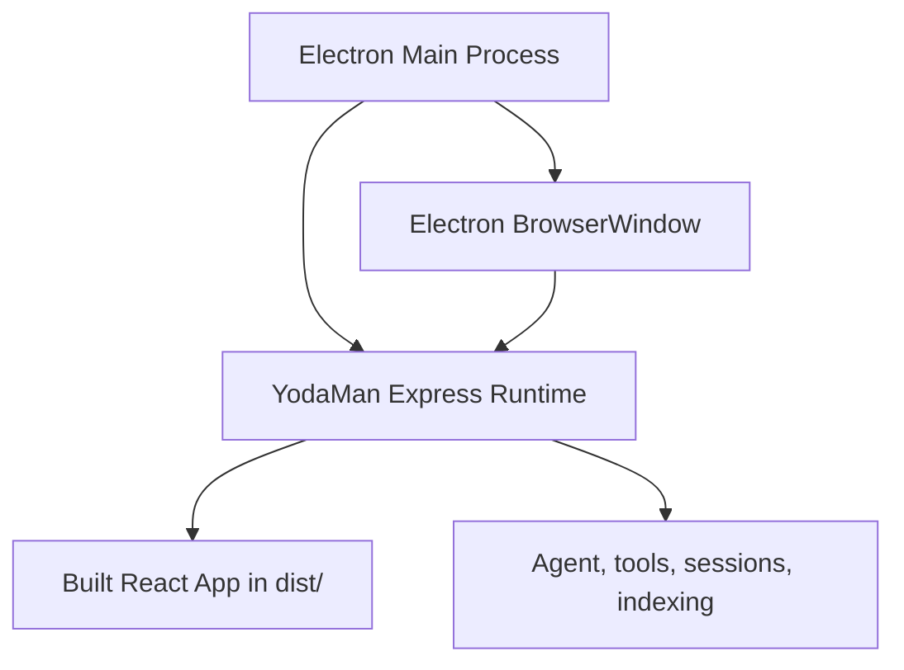

# YodaMan Desktop App

The desktop app packages the existing React interface with Electron and runs the existing Node backend as a managed local sidecar.

## Architecture



## Development Run

From the repository root:

```bash
npm run desktop
```

This command builds the React app, starts Electron, starts the backend if nothing is already listening on port `3090`, and loads `http://127.0.0.1:3090`.

## Package Directory Build

From the repository root:

```bash
npm run desktop:pack
```

This creates an unpacked desktop application in `release/`.

## Full Distribution Build

From the repository root:

```bash
npm run desktop:dist
```

The initial builder configuration targets unpacked app directories for macOS, Windows, and Linux. Installer formats can be added after the desktop runtime flow is validated.

## Runtime Behavior

- If a YodaMan runtime is already available on port `3090`, the desktop app reuses it.
- If no runtime is available, Electron starts `server.js` as a sidecar process.
- The sidecar process is stopped when the Electron app quits.

