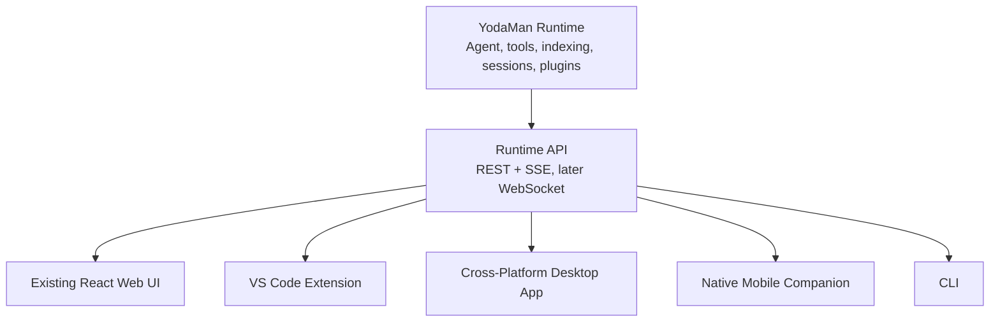

# YodaMan Agent Ecosystem Architecture

## Purpose

YodaMan is a local-first developer intelligence platform. The current application already provides a React user interface, an Express API, a ReAct-style agent runtime, Context Expert CLI integration, project indexing, file watching, tool execution, plugin tools, session persistence, and human approval for agent writes.

The ecosystem plan extends that runtime into three integrated clients:

- A Visual Studio Code extension for editor-native agent work.
- A native mobile companion for approvals, monitoring, search, and lightweight commands.
- A cross-platform desktop application that becomes the control center for projects, models, plugins, indexing, sessions, and device pairing.

The key architectural rule is that these clients should not duplicate agent logic. They should communicate with a shared YodaMan runtime through a stable API and event protocol.

## Current Runtime Shape

The current repository uses a clean layered architecture:

- Presentation: React and Vite.
- Interface: Express routes in `backend/interfaces/RestController.js`.
- Core: Agent orchestration and indexing queue services in `backend/core`.
- Infrastructure: Context Expert CLI wrapper, file watching, session storage, and tool execution in `backend/infrastructure`.

The runtime currently exposes:

- `GET /api/projects` for indexed and watched projects.
- `POST /api/projects` and `DELETE /api/projects` for project management.
- `POST /api/ask` for direct context questions.
- `POST /api/agent/task` for Server-Sent Events agent execution.
- `POST /api/agent/approve` for human approval of file writes.
- `GET /api/search` for semantic code search.
- `GET /api/status` and `GET /api/check` for health and diagnostics.
- `GET /api/plugins`, `POST /api/plugins`, and `DELETE /api/plugins/:name` for plugin management.
- `GET /api/agent/tasks`, `GET /api/agent/tasks/:taskId/events`, and `GET /api/agent/pending-approvals` for persisted task timelines.
- `GET /api/desktop/diagnostics` and `POST /api/pairing` for desktop and mobile companion flows.

## Target System

## Runtime Responsibilities

The runtime should own:

- Agent execution and reasoning loops.
- Tool registry and plugin loading.
- Tool permissions, audit logs, and write approval state.
- Append-only local audit and task history.
- Project indexing and file watching.
- Workspace identity and path validation.
- Session persistence.
- Model and provider configuration.
- Event streaming for task progress.

## Client Responsibilities

Each client should own its own user experience:

- Rendering streamed task events.
- Capturing user prompts and commands.
- Asking the runtime to start, approve, reject, or cancel tasks.
- Showing diffs, logs, and status in a platform-native way.
- Managing notifications and device-specific affordances.

Clients should treat the runtime API as the source of truth.

## VS Code Extension

The VS Code extension should make YodaMan feel present inside the editor.

Ideal capabilities:

- Activity Bar sidebar with project status, chat/task history, current agent run, plugins, and model/runtime health.
- Command palette commands for asking about the workspace, running agent tasks, semantic search, reindexing, explaining files, refactoring selections, and starting or stopping the runtime.
- Editor context actions for explaining selections, generating tests, finding related code, and creating tasks from diagnostics.
- Inline code actions for quick fixes, suggested refactors, docstrings, and test generation.
- A `YodaMan` output channel for runtime logs, indexing progress, tool calls, and errors.
- Native VS Code diff review for agent write approvals.

The first valuable milestone is:

> From VS Code, a user can ask YodaMan about the current workspace, run an agent task, watch tool events stream live, review a proposed file change in a native diff, and approve or reject it.

## Mobile Companion

The mobile client should avoid trying to become an IDE. Its strongest workflows are oversight and lightweight action:

- Monitor running agent tasks.
- Approve or reject proposed changes.
- Search indexed projects.
- Ask questions about a repository.
- Receive notifications when a task needs approval or finishes.
- Review summaries of completed tasks.

Mobile connection modes:

- Local network pairing for the first version.
- Optional secure relay later for remote access without exposing the local machine directly.

## Cross-Platform Desktop App

The existing React app can evolve into the cross-platform desktop app.

Recommended first implementation:

- Package the current React app with Electron.
- Run the Node backend as a managed sidecar.
- Add OS notifications, tray actions, file picking, and update support.
- Add onboarding for VS Code extension and mobile pairing.

Electron is the fastest path because the repository is already Node-based. Tauri can be reconsidered later if binary size and memory footprint become more important than development speed.

## Protocol Direction

The API should become versioned and explicit. Near-term improvements:

- Consistent task lifecycle events.
- Immediate task identity event when a task starts.
- Task cancellation endpoint.
- Stable error shapes.
- Workspace-scoped path validation.
- Patch-based file changes instead of full-file writes.

Server-Sent Events are adequate for the first editor integration because task output primarily streams from the runtime to the client. WebSocket subscriptions would be useful later for live multi-client task control, faster approval notifications, cancellation, presence, and collaborative state. They would not automatically make every workflow better: REST is still simpler for request/response actions, SSE is still good for one-way task timelines, and WebSocket adds connection, authentication, reconnection, and back-pressure complexity.

Shared protocol constants and TypeScript declarations live in `shared/`, so clients can share event names and task shapes while the runtime remains CommonJS-compatible.

## Security Direction

The most important safety areas are:

- Restrict file operations to trusted workspaces.
- Require approval for writes and risky shell commands.
- Audit every tool call.
- Add command allow and deny rules.
- Add plugin permissions.
- Prefer patch application over arbitrary full-file writes.
- Treat mobile and remote clients as untrusted until paired and authorized.
